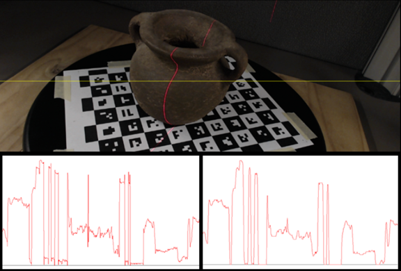
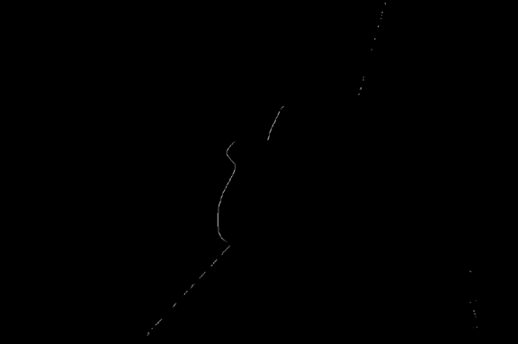
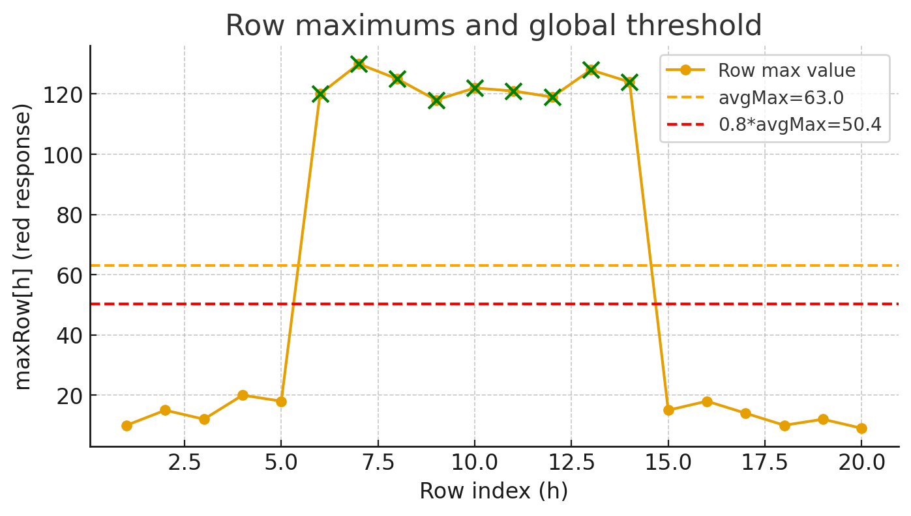

# 3d-scanning-demos

## Laser Line Detection

The `detectLaser` function detects a vertical red laser line in an image through the following steps:

1. **Smoothing**: Apply Gaussian filtering to reduce noise.  
2. **Red channel response**: Compute `v = r - (g+b)/2`, which highlights red pixels.  
3. **Row maxima**: For each row, find the maximum response value.  
4. **Adaptive thresholding**: Compute a global average maximum (`avgMax`) and use `T = 0.8 * avgMax` to filter out weak responses.  
5. **Line extraction**: For each row, keep only the peak pixel if above threshold; set all others to black.

### Example

Input image with intensity profile (before and after filtering):

Final detected laser line (binary output):

The core algorithm (`detectLaser`) enhances the red channel and detects the vertical laser line as follows:

1. Apply Gaussian blur to smooth the input image.  
2. Compute the red response for each pixel:  
  `v = r - (g + b) / 2,  v >= 0`
3. For each row, find the maximum response (`maxRow[h]`).  
4. Compute the global average maximum (`avgMax`) and define a threshold `T = 0.8 * avgMax`.  
5. Keep only the peak pixel per row if its value ≥ T, set others to 0.

The figure below illustrates the process:

- **Orange line** = row maxima (`maxRow[h]`)  
- **Orange dashed line** = global average (`avgMax`)  
- **Red dashed line** = threshold (`0.8 * avgMax`)  
- **Green points** = rows where a valid laser peak is detected  

