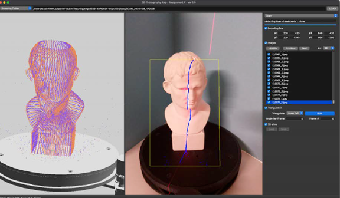

# 3d-scanning-demos
## 📌 Project Overview

The scanner system consists of:
- A **Raspberry Pi–based turntable laser scanner** with dual line lasers.  
- A **Qt application (LaserScanner2024-A-04)** that communicates with the scanner over the network.  
- Automated **image capture** with turntable rotation and laser switching.  
- **Calibration** pipeline:
  - Camera calibration (intrinsics)
  - Turntable calibration (rotation axis & plane)
  - Laser plane calibration (laser geometry)  
- **3D reconstruction** by detecting laser lines in captured images and triangulating 3D points to build a dense point cloud.

---

## Laser Line Detection

The `detectLaser` function detects a vertical red laser line in an image through the following steps:

1. **Smoothing**: Apply Gaussian filtering to reduce noise.  
2. **Red channel response**: Compute `v = r - (g+b)/2`, which highlights red pixels.  
3. **Row maxima**: For each row, find the maximum response value.  
4. **Adaptive thresholding**: Compute a global average maximum (`avgMax`) and use `T = 0.8 * avgMax` to filter out weak responses.  
5. **Line extraction**: For each row, keep only the peak pixel if above threshold; set all others to black.

### Example

Input image with intensity profile (before and after filtering):

Final detected laser line (binary output):

The core algorithm (`detectLaser`) enhances the red channel and detects the vertical laser line as follows:

1. Apply Gaussian blur to smooth the input image.  
2. Compute the red response for each pixel:  
  `v = r - (g + b) / 2,  v >= 0`
3. For each row, find the maximum response (`maxRow[h]`).  
4. Compute the global average maximum (`avgMax`) and define a threshold `T = 0.8 * avgMax`.  
5. Keep only the peak pixel per row if its value ≥ T, set others to 0.

The figure below illustrates the process:

- **Orange line** = row maxima (`maxRow[h]`)  
- **Orange dashed line** = global average (`avgMax`)  
- **Red dashed line** = threshold (`0.8 * avgMax`)  
- **Green points** = rows where a valid laser peak is detected  

## Camera Calibration and Optical Triangulation  

This project was developed as part of **ENGN2502: 3D Photography (Fall 2024, Brown University)**.  
The goal is to implement **camera calibration** and **laser line triangulation** to reconstruct 3D point clouds from structured light scanning.  

---

## 📷 Camera Calibration
- Used the MATLAB Camera Calibration Toolbox to estimate intrinsic and extrinsic parameters.  
- Validated calibration accuracy by implementing a reprojection function in C++ with Eigen.  
- Achieved reprojection error (RMSE) < **0.5 pixels**.  

---
## 🔺 Optical Triangulation
- Implemented **ray–plane intersection** in C++ to compute 3D points from detected laser line pixels.  
- Converted points from the camera coordinate system to the world coordinate system, accounting for turntable rotation.  
- Generated 3D point clouds of scanned objects.  

**Pipeline Illustration:**  

**Pipeline:**  
1. Detect laser line.  
2. Back-project pixels to rays using camera intrinsics.  
3. Intersect rays with the laser plane.  
4. Transform results into world coordinates.  
5. Undo turntable rotation to align all scans.  

---

## 🛠️ Technologies
- **C++** (Eigen, Qt)  
- **MATLAB** (Camera Calibration Toolbox)  
- **Meshlab** (point cloud visualization)  

---

## 📊 Results
Below is an example of the reconstructed **3D point cloud** of a scanned vase:  

  

---

# Turntable and Laser Plane Calibration

The goal is to align the **camera, laser plane, and turntable** within a unified world coordinate system, so that laser pixels captured in images can be accurately reconstructed as 3D points.

## 🎯 Objectives
- Calibrate the camera to obtain intrinsic parameters (focal length, principal point, distortion).  
- Estimate the pose `(R, T)` of a vertical checkerboard in multiple images.  
- Detect laser pixels constrained by a bounding region on the checkerboard.  
- Triangulate detected laser pixels into 3D points via ray–plane intersection.  
- Fit the laser plane equation using the reconstructed 3D points.  
- Estimate the turntable’s center of rotation and axis, defining the world coordinate system.  
- Validate calibration by projecting virtual wireframe geometry (e.g., a polygonal cylinder) onto the images.  

## 🖼️ Illustrations
The following figure shows how multiple checkerboard poses are used to sample the laser plane and fit its equation:

The next figure shows an augmented reality overlay of a wireframe cylinder, verifying the stability and correctness of the turntable calibration:

## 🧠 Key Points
- A vertical checkerboard provides 3D intersection lines with the laser, avoiding the ambiguity of a single line on the turntable plane.  
- Triangulated 3D points should remain fixed in the **camera coordinate system**, appearing as parallel line segments across different views.  
- The projection of the turntable’s rotation center should remain the same pixel in all images. The world coordinate system is defined with x/y in the turntable plane and z pointing upward.

  # Turntable Laser Scanner (ENGN2502 Assignment 04)

This project is my implementation of **Assignment 04** for the course *ENGN2502: 3D Photography* at Brown University (Fall 2024).  

The assignment integrates the work from previous assignments (homework 1–3) into a complete **3D turntable laser scanning system**.  

---

---
## ⚙️ Features Implemented
- Integrated OpenCV (v4.10.0) for checkerboard detection and calibration.  
- Implemented **laser detection** (using background subtraction) and **triangulation** methods.  
- Automated pipeline: **Capture → Calibrate → Scan → Reconstruct**.  
- Support for single-laser or dual-laser scanning, with or without color.  

---

## 🖼️ Hardware Setup

The 3D scanner used in this assignment:  

---

## 🎯 Scanning Results

Example result: scanning a bust object.  
Left: reconstructed 3D point cloud from laser triangulation.  
Right: captured image with detected laser line overlay.  

---

